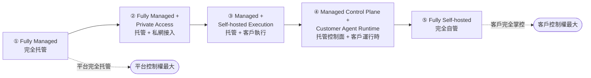
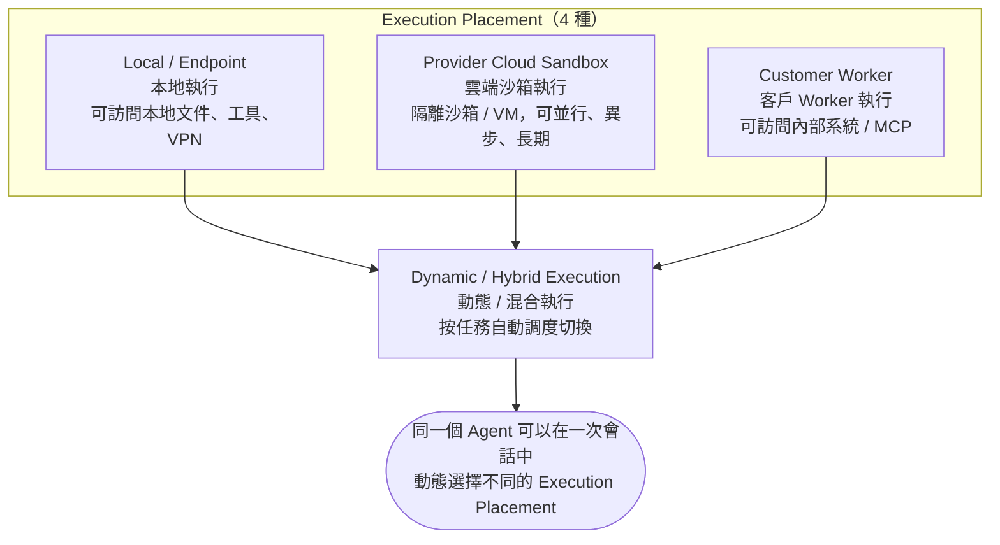
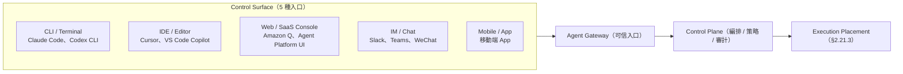
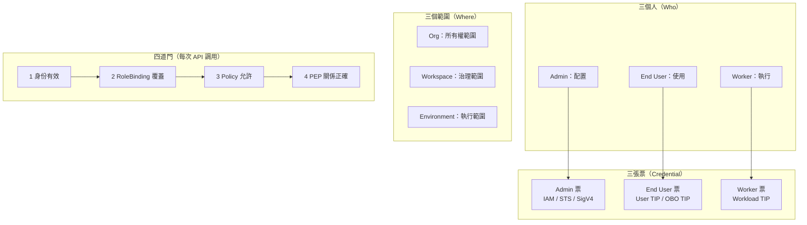
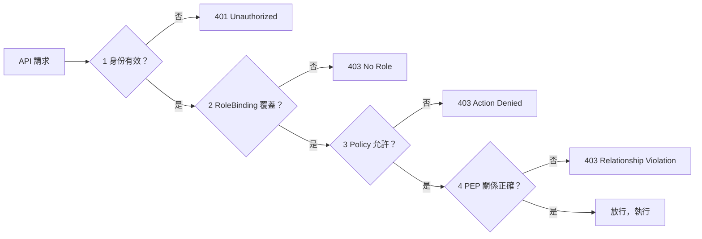
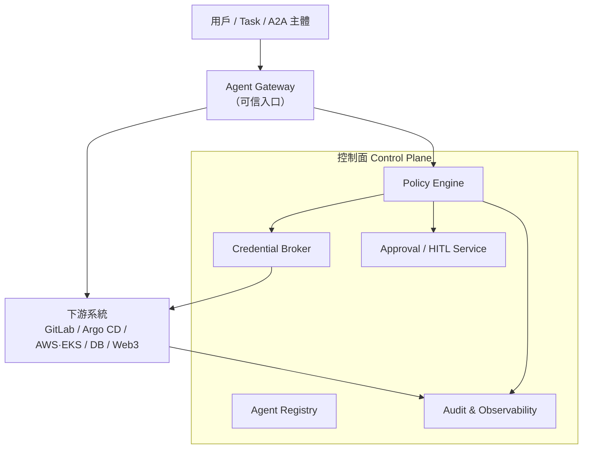
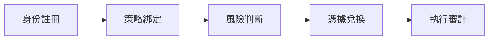

## 2.21 Agent 治理與安全（Agent Governance & Security） {#a21-gov}

> **來源聲明（答問前必讀）**
>
> - §2.21.2–§2.21.4（部署模式 / Execution Placement / Control Surface）同 §2.21.5（AgentKit MA 三個人 / 三個範圍 / 三張票 / 四道門）：**內部架構材料**（原圖見 §2.21.9）。
> - §2.21.6（Agent Trust Plane）：**內部方案文本**，唔係 BytePlus 官方產品文檔。
> - §2.21.7 先係**官方能力對照**——答「官方點講」要引官方 URL；答「企業點設計治理層」可以引 §2.21.2–§2.21.6，但要標明係內部框架。
>
> 原圖另有多幅飛書內嵌圖「暫時無法在飛書文件外展示此內容」，本文已用文字流程 / Mermaid 圖代替。

### 2.21.1 一頁速覽 {#a21-overview}

| 問題 | 一句答案 |
|----|----|
| Agent 部署有幾種模式？ | 5 種，由「平台完全托管」到「客戶完全自管」嘅控制權光譜（§2.21.2） |
| 任務實際上喺邊執行？ | 4 種：Local / Provider Cloud Sandbox / Customer Worker / Dynamic Hybrid（§2.21.3） |
| 用戶由邊度用 Agent？ | 5 種：CLI / IDE / Web Console / IM Chat / Mobile App（§2.21.4） |
| AgentKit MA 點管身份？ | 三個人（Admin / End User / Worker）× 三個範圍（Org / Workspace / Environment）× 三張票（TIP）× 四道門（授權檢查鏈）（§2.21.5） |
| 想「唔改現有系統」都管住 Agent？ | 用 Agent Trust Plane：身份註冊 → 策略綁定 → 風險判斷 → 憑據兌換 → 執行審計（§2.21.6） |
| 風險點分級？ | L0 自動允許 / L1 只讀留痕 / L2 二次確認 / L3 強制 HITL（§2.21.6.7） |

### 2.21.2 部署模式：五種控制權光譜 {#a21-modes}

企業買 Agent 平台，第一個要答嘅唔係「功能有咩」，而係**「邊個話事」**——控制面（Control Plane）
同執行面（Runtime / Worker）分別放喺邊，直接決定咗網絡可達性、數據邊界、合規責任同運維負擔。

| # | 模式 | 控制面 / Harness | Agent Runtime / State | Worker / Tool Execution | 客戶網絡訪問方式 | 客戶主要負責 | 典型形態 |
|---|------|------------------|----------------------|-------------------------|------------------|--------------|----------|
| ① | **Fully Managed** | 平台雲 | 平台雲 | 平台雲 | 公網 API / SaaS Connector | Agent 配置、Tools、Knowledge、業務權限 | 普通 SaaS Agent、Cloud Agent |
| ② | **Fully Managed + Private Access** | 平台雲 | 平台雲 | 平台雲 | 通過 PrivateLink / PSC / VPC Lattice 等進入客戶私網 | 私網接入、IAM、Security Group、目標資源授權 | AWS DevOps Agent、AWS Security Agent、Google Runtime + PSC |
| ③ | **Managed + Self-hosted Execution** | 平台雲 | 平台雲 | **客戶網絡**（Worker / Sandbox） | Worker 位於客戶網絡，可原生訪問內部資源 | Worker / Sandbox、鏡像、網絡、憑證、執行環境安全 | Claude Managed Agents + Self-hosted Sandbox |
| ④ | **Managed Control Plane + Customer Agent Runtime** | 平台雲（管理、編排、觀測、計費等） | **客戶網絡**（Agent Server / DB / State） | 客戶網絡（Worker / Tool Execution） | 客戶網絡原生訪問內部資源 | Agent Runtime、State、Worker、Data Plane、網絡和運行可審計 | LangSmith Hybrid / BYOC 類架構 |
| ⑤ | **Fully Self-hosted** | 客戶網絡（VPC / On-prem） | 客戶網絡 | 客戶網絡 | 客戶網絡原生訪問內部資源 | 全棧：Control Plane、Runtime、Worker、升級、HA、安全、運維全部自負責 | LangGraph / ADK / 自研 Agent、Self-hosted LangSmith |

**點揀（決策提示）：**

- **① / ②**：最快落地，適合標準化 SaaS 場景；② 係「唔想數據過公網」嘅最低成本方案。
- **③**：想要托管嘅便利，但工具執行必須喺自己 VPC 內（例如要連內部 DB / 內網 MCP）。
- **④**：控制面用托管（慳咗編排、觀測、計費嘅工程），但 Agent 運行時同 State 一定要留喺自己側——合規要求高嘅金融 / 醫療最常揀呢個。
- **⑤**：完全自主，代價係要自己養齊升級、HA、安全、運維。

{{IMG_DEPLOY}}

### 2.21.3 Execution Placement（任務實際喺邊執行） {#a21-placement}

同一隻 Agent，喺**一次會話內**都可以動態揀唔同嘅執行位置——呢個係現代 Agent 平台同舊式
「一個 bot 一個 server」最大嘅分別。

| 執行位置 | 邊個嘅資源 | 特徵 | 適合 |
|----------|-----------|------|------|
| **Local / Endpoint Execution** | 用戶終端 | 任務喺用戶終端執行，可訪問本地文件、工具、VPN 等 | 更偏個人 / 即時 |
| **Provider Cloud Sandbox** | 平台雲 | 任務喺平台雲嘅隔離沙箱 / VM 中執行，可並行、異步、長期運行 | 通用、突發、可並行 |
| **Customer Worker Execution** | 客戶 VPC / On-prem | 任務喺客戶 VPC / On-prem 嘅 Worker 中執行，可訪問內部系統 / MCP | 更偏企業 / 敏感 / 長任務 |
| **Dynamic / Hybrid Execution** | 混合 | 根據任務自動喺 Local / Cloud / Customer Worker 之間調度和切換 | 真實生產場景 |

> **治理含意（好重要）：** 執行位置一變，「憑據喺邊注入、日誌喺邊落、數據有冇出境」全部跟住變。
> 所以 Governance 設計一定要**以 Execution Placement 為維度**去定策略，唔可以只按 Agent 名去管。

### 2.21.4 Control Surface（用戶從哪裡用 Agent） {#a21-surface}

| Control Surface | 例子 | 治理關注點 |
|-----------------|------|-----------|
| **CLI / Terminal** | Claude Code、Codex CLI | 本機檔案系統權限、shell 逃逸 |
| **IDE / Editor** | Cursor、VS Code Copilot | 工作區範圍、extension 供應鏈 |
| **Web / SaaS Console** | Amazon Q、Agent Platform UI | SSO、Session 時效、多租戶隔離 |
| **IM / Chat** | Slack、Teams、WeChat | 身份映射（IM ID ↔ 企業身份）、訊息留存 |
| **Mobile / App** | 移動端 App | 裝置合規、Token 存放 |

**如何組合使用（示例）：**

| 場景 | 控制面（用邊度入） | 控制面（托管方） | 執行面（邊度跑） |
|------|-------------------|------------------|------------------|
| Claude Managed Agents + Self-hosted Sandbox | Web / API | Managed Platform | Customer Worker |
| Codex / Cursor | IDE / CLI | Managed Platform | Cloud Sandbox / Local / Customer Worker（Dynamic） |
| LangSmith Hybrid | Web UI | Managed CP（LangChain Cloud） | Customer Runtime |

> 一句總結：**Control Surface 係「入口」，Control Plane 係「大腦」，Execution Placement 係「手腳」。**
> 治理要同時覆蓋三層——只守入口（例如 SSO）而唔管執行面憑據，係最常見嘅漏洞。

### 2.21.5 AgentKit MA：三個人、三個範圍、三張票、四道門 {#a21-ma}

呢個係 AgentKit MA（Managed Agent）嘅身份與授權模型。記住呢四個「三 / 四」，
就可以準確答「邊個、喺咩範圍、憑咩票、過咩門」。

#### 2.21.5.1 三個人（Who） {#a21-ma-who}

| 角色 | 做咩 | 一句話 |
|------|------|--------|
| **Admin** | 配置 | 平台管理員，配 Workspace / Environment / Policy / RoleBinding |
| **End User** | 使用 | 終端用戶，透過業務後端發起會話、調用 MCP 工具 |
| **Worker** | 執行 | Worker 執行節點（Agent Runtime），領任務、執行任務 |

#### 2.21.5.2 三個範圍（Where） {#a21-ma-scope}

| 範圍 | 性質 | 說明 |
|------|------|------|
| **Org** | 所有權範圍 | 組織級，最高權限邊界 |
| **Workspace** | 治理範圍 | 工作區級，會話粒度 |
| **Environment** | 執行範圍 | 環境級，任務粒度 |

#### 2.21.5.3 三張票（不同身份、不同權限） {#a21-ma-tickets}

| 票 | 全稱 / 憑據形式 | 持有者 | 數據面（可以掂咩） | 簽發方 | 作用範圍 | 關鍵動作 |
|----|----------------|--------|-------------------|--------|----------|----------|
| **Admin 票** | IAM / STS / SigV4 | 平台管理員 | 控制面：Workspace、Environment、Policy、RoleBinding | 雲平台 IAM | **Org** 級別，最高權限 | `CreateWorkspace`、`BindRole`、`SetPolicy` |
| **End User 票** | User TIP / OBO TIP | 終端用戶（通過客戶業務後端） | 數據面：發起會話、調用 MCP 工具、訪問資源 | AgentKit MA Identity Service（OAuth 流程） | **Workspace** 級別，會話粒度 | `CreateSession`、`InvokeTool` |
| **Worker 票** | Workload TIP | Worker 執行節點（Agent Runtime） | 數據面：領工作項、執行任務、訪問 Environment 資源 | AgentKit MA Identity Service | **Environment** 級別，任務粒度 | `ClaimWork`、`ExecuteTask` |

> **OBO TIP = On-Behalf-Of TIP**：用戶授權 Agent 代為操作時用嘅票。
> 記法：**Admin 管「配置」、User 管「用」、Worker 管「跑」；票越細，範圍越細。**

#### 2.21.5.4 四道門（每次 API 調用必過嘅授權檢查鏈） {#a21-ma-gates}

| # | 門 | 問咩問題 | 校驗內容 | 失敗後果 |
|---|----|----------|----------|----------|
| ① | **身份有效** | 你是你嗎？ | JWT / TIP 簽名是否合法、是否過期、Audience 是否匹配 | `401 Unauthorized` |
| ② | **RoleBinding 覆蓋** | 你在這裡有角色嗎？ | Principal 在目標 Workspace / Environment 是否存在有效 RoleBinding | `403 No Role` |
| ③ | **Policy 允許** | 你的角色能做這個動作嗎？ | RoleBinding 對應嘅 Role 是否包含請求嘅 Action（如 `CreateSession`、`ClaimWork`） | `403 Action Denied` |
| ④ | **PEP 關係正確** | 這些對象屬於同一個體系嗎？ | 服務端驗證 Session、Worker、Resource 是否都屬於同一 Workspace / Environment，防止跨租戶、跨範圍攻擊 | `403 Relationship Violation` |

**除錯口訣：** 睇 error code 就知撞邊道門——
`401` 係票本身有問題（過期 / 簽名 / audience）；
`403 No Role` 係冇綁角色（RoleBinding 缺）；
`403 Action Denied` 係角色存在但 action 唔夠（Policy / Role 定義問題）；
`403 Relationship Violation` 係對象跨咗 Workspace / Environment（最易漏，通常係 ID 傳錯）。

#### 2.21.5.5 落地檢查清單 {#a21-ma-checklist}

- [ ] 每個 Agent 有冇**獨立身份**（唔共享平台 API Key）？
- [ ] Admin / End User / Worker 三種票有冇**分開簽發**、分開輪換？
- [ ] RoleBinding 係綁喺 **Workspace** 定 **Environment**？會唔會綁得太闊？
- [ ] Policy 有冇寫死「高風險 action」（例如 `merge`、`delete`、`transfer`）需要額外審批？
- [ ] 四道門嘅失敗日誌有冇入可觀測（方便事後還原「邊道門拒咗」）？

{{IMG_MA}}

### 2.21.6 Agent Trust Plane（企業自建治理層） {#a21-trust}

> 呢節係**內部方案文本**整理版，唔係 BytePlus 官方產品文檔。
> 用途：當客戶問「我唔想重構現有系統，但又想管住 Agent 對生產環境嘅訪問」時，照呢個框架答。

#### 2.21.6.1 方案定位 {#a21-trust-position}

Agent Trust Plane 讓企業能夠**在不重構現有系統的前提下**，把 Agent 的生產訪問統一納入
**身份、權限、憑據和審計**治理。低風險操作自動執行，中風險操作二次確認，高風險操作觸發 HITL 審批；
**Agent 不直接持有生產密鑰**，所有下游憑據都由 Broker 在授權通過後按次注入。

它**不替換**客戶已有的 Agent 平台、AIOps、GitOps、發布系統或雲原生權限體系，
而是把 Agent 對生產資源的訪問**統一收口到可信入口**。解決四個核心問題：

| # | 問題 | 要達到嘅效果 |
|---|------|-------------|
| 1 | **誰在調用** | 用戶、Agent、後台任務、Pipeline 或 Agent-to-Agent 調用都具備可識別身份 |
| 2 | **能做什麼** | 權限不再是一把長期 Token，而是按主體、動作、資源、上下文和風險等級**動態判斷** |
| 3 | **憑據在哪裡** | Agent 不接觸 GitLab Token、雲 AK/SK、數據庫密碼、交易密鑰等敏感憑據 |
| 4 | **如何追責** | 每次操作都能還原觸發主體、執行 Agent、目標資源、策略結果、審批記錄和下游結果 |

#### 2.21.6.2 總體架構與架構原則 {#a21-trust-arch}

**四條架構原則：**

1. **控制面和數據面分離**：雲賬號、AK/SK 或 STS 用於發布和管理；用戶與 Agent 調用使用 OIDC / JWT。
2. **Agent 與任務身份分離**：後台任務不冒充用戶，Agent 不共享平台級 API Key。
3. **策略和憑據分離**：Policy 判斷是否允許，Credential Broker 只在授權通過後注入憑據。
4. **存量系統原生權限保留**：GitLab、Argo CD、AWS/EKS、數據庫等繼續使用各自熟悉的 Token、Role、STS、RBAC 或 OAuth 權限體系。

#### 2.21.6.3 信任鏈：Agent 權限如何建立 {#a21-trust-chain}

Agent 權限不是給一個粗粒度角色，而是建立一條完整的信任鏈：

**Agent Workload Identity** — 每個可訪問生產資源的 Agent 都應註冊為**獨立身份**，
而不是共享一個平台 API Key。建議身份字段：

| 字段 | 說明 |
|------|------|
| `agent_id` | Agent 唯一身份 |
| `agent_name` | 業務可讀名稱 |
| `owner_team` | 歸屬團隊 |
| `runtime_env` | `dev` / `staging` / `prod` |
| `allowed_tools` | 允許調用的工具集合 |
| `allowed_routes` | 允許訪問的網關路由 |
| `risk_level` | 默認風險等級 |
| `status` | `active` / `disabled` / `rotated` |
| `version` | Agent 版本或發布批次 |

**三類主體要分開：**

| 場景 | 主體表達 | 適用情況 |
|------|----------|----------|
| **用戶交互** | 用戶是資源訪問主體，Agent 是代表用戶行動的執行者 | 用戶通過門戶、飛書、Web App 發起操作 |
| **後台任務** | Scheduler / Pipeline 是觸發主體，Agent 是執行主體 | 巡檢、告警分析、定時報表、自動修復 MR |
| **Agent-to-Agent** | 上游 Agent 是調用主體，下游 Agent 是目標服務 | 多 Agent 協作、跨 Runtime 調用、任務分派 |

> **對外表達建議**：Agent 權限不是一個單一角色，而是
> `User / Task + Agent + Tool + Resource + Action + Context` 的組合判斷。

#### 2.21.6.4 Policy Engine（五元組） {#a21-trust-policy}

| 元素 | 取值示例 |
|------|----------|
| **Subject** | `user_id` / `task_id` / `agent_id` / `client_id` |
| **Action** | `read` / `create_mr` / `approve` / `sync` / `rollback` / `transfer` / `write_config` |
| **Resource** | `repo` / `branch` / `namespace` / `database` / `wallet` / `account` / `document` |
| **Context** | `env` / `time` / `risk_score` / `amount` / `data_classification` / `approval_status` |
| **Effect** | `allow` / `deny` / `require_approval` / `require_step_up` |

**示例策略：**

| 場景 | 策略示例 |
|------|----------|
| **GitLab 自動修復** | Agent 可以讀取指定 Repo，並在 `fix/agent-*` 分支創建 MR，但**不能 merge** |
| **發布狀態巡檢** | Release Guard Agent 可以讀取 Argo CD Application 狀態，但**不能執行 sync 或 rollback** |
| **EKS 診斷** | Ops Diagnosis Agent 可以讀取指定 Namespace 的 Pod、Event、Log，但**不能 delete、scale 或 patch** |
| **Web3 交易** | Transfer Agent 可生成交易意圖，超過閾值金額**必須 HITL**，且**不能直接持有私鑰** |
| **金融數據分析** | Analysis Agent 可讀取授權組合數據，但**不能導出越權客戶數據或原始 PII** |

#### 2.21.6.5 憑據治理：Agent 不直接持有密鑰 {#a21-trust-credential}

Credential Broker 負責在授權通過後，為本次操作換取或注入**最小權限憑據**：

| 下游系統 | 憑據方式 | 第一階段建議開放範圍 |
|----------|----------|---------------------|
| **GitLab** | 托管 Project Token / Bot Token | 讀 Repo、建分支、創建 MR；**不允許 merge** |
| **Argo CD** | Project Role Token | 讀取 Application 和發布狀態；寫操作後續單獨授權 |
| **AWS / EKS** | OIDC Federation → STS → EKS Token | 指定 Cluster / Namespace **只讀診斷** |
| **SaaS / 數據庫** | OAuth Token / Service Account / 臨時數據庫憑據 | 按租戶、數據域、字段級權限限制 |
| **Web3 / 交易系統** | 交易意圖 + 簽名服務 / 審批服務 | Agent **不持私鑰**，高風險動作強制審批 |

#### 2.21.6.6 調用鏈路設計 {#a21-trust-paths}

| 鏈路 | 設計要點 |
|------|----------|
| **用戶調用** | 用戶不需要雲賬號，也不接觸 AK/SK。Runtime 只接受可信 UserPool / OIDC 簽發，並命中 allowed client 的 JWT。 |
| **後台任務調用** | 後台任務**不冒充人類用戶**，而是使用任務自己的 Service Principal。審計時可以明確回答：哪個任務觸發了哪個 Agent。 |
| **Agent-to-Agent 調用** | 上游 Agent **不保存**下游 Agent 密鑰。所有 A2A 調用統一經過 Broker、Gateway 和審計。 |

#### 2.21.6.7 風險分級與 HITL {#a21-trust-risk}

| 等級 | 操作類型 | 治理要求 |
|------|----------|----------|
| **L0** | 公開知識問答、無敏感數據檢索 | 自動允許，基礎日誌 |
| **L1** | 授權範圍內只讀查詢 | 策略校驗，審計留痕 |
| **L2** | 可逆寫操作，如創建 MR、創建工單、生成配置變更建議 | 策略校驗，必要時二次確認 |
| **L3** | 生產發布、回滾、資金轉賬、權限變更、刪除數據 | **強制 HITL 或多方審批** |

> **LLM-as-judge** 可以用於風險分類和意圖判斷，但**不應作為最終唯一授權源**。
> 最終執行應由 Policy Engine、審批狀態和 Credential Broker **共同決定**。

#### 2.21.6.8 首期 PoC 建議 {#a21-trust-poc}

建議從 **Agent 自動創建修復 MR** 開始，而不是一上來開放生產寫權限。

| Phase | 內容 | 要點 |
|-------|------|------|
| **Phase 1** | **GitLab 修復 MR** | 註冊 1–2 個 Agent Workload Identity；註冊 1 個 Scheduler / Task Service Principal；配置指定 GitLab Project、目標分支、允許修改目錄；Agent 可讀代碼、生成修復分支、創建 MR；**不允許 merge，不允許直接發布** |
| **Phase 2** | **Argo CD 只讀發布狀態** | 讀取 Application、版本、同步狀態和健康狀態；將 MR、發布狀態和驗證結果關聯起來；Sync / Rollback 仍按客戶既有流程 |
| **Phase 3** | **EKS 只讀診斷** | 通過 OIDC Federation 換取 STS 臨時憑據；限定 Cluster、Namespace、Verb 和 Resource；先開放 Pod、Event、Log、Deployment 狀態讀取 |
| **Phase 4** | **受控可逆生產動作** | 選擇一個低風險、可回滾、可審批的動作；強制 HITL、限流、審計和回放；根據真實收益逐步擴大權限範圍 |

**Phase 1 驗收標準（六條）：**

1. 合法 Agent 可以在指定項目創建 MR。
2. 未授權 Agent 被拒絕。
3. Agent 嘗試修改非授權目錄被拒絕。
4. Agent 停用後立即無法調用。
5. Credential 輪換後 Agent 無需改代碼。
6. 審計日誌能還原完整調用鏈。

#### 2.21.6.9 雙方建設邊界 {#a21-trust-boundary}

| 責任方 | 主要建設內容 | 交付結果 |
|--------|-------------|----------|
| **平台側** | Agent 身份接入、任務委託、網關校驗、Policy、Credential Broker、審計與觀測 | 可復用的 Agent Trust Plane 能力 |
| **客戶側** | 提供 Agent Registry、Scheduler 身份來源、下游系統原生權限、網絡訪問邊界 | 可信主體數據、最小權限配置和受控網絡路徑 |
| **雙方共同** | 確認首批 Agent、任務、Route、資源範圍、允許操作、風險等級和審批條件 | 權限基線、接入清單和驗收矩陣 |

> **生產階段必須通過私網、ACL、安全組、源站白名單或專線限制繞過訪問。**
> 只有當 Agent Gateway 成為**受控路徑**時，Trust Plane 才能形成完整閉環。

### 2.21.7 對照官方 AgentKit / VeADK：邊度可以落地 {#a21-official}

上面嘅治理框架，落到 BytePlus / Volcengine 官方能力上，對應如下
（官方 URL 一律以實時 fetch 為準；下面章節只作本文件內嘅索引）：

| 治理能力 | 官方對應 | 睇邊 |
|----------|----------|------|
| 身份 / 權限（Org–Workspace–Environment 層級、策略類型、授權流程） | **AgentKit IAM**（IAM overview、IAM policy types、Granting permissions to IAM users）+ **Agent Identity**（用戶池、工作負載身份、憑證庫） | §2.17 Identity & 權限（IAM）；官方入口 `https://docs.byteplus.com/en/docs/agentkit/` |
| 可信入口 / 統一收口 | **AgentKit Gateway**（MCP 網關）+ AI Gateway | §2.11 Gateway 網關、`veadk-agentkit-gateway.md` |
| Runtime 側安全（出入站認證、憑證注入） | **Agent Runtime 安全最佳實踐** | §2.6 Agent Runtime 詳解 → Runtime 安全最佳實踐 |
| 審計 / 追責 | **Observability + 日誌**（trace / span / log） | §2.16 Observability 同日誌；`veadk-agentkit-rbac-observability.md` |
| 輸入輸出防護（PII、越權） | **Guardrail / Inbound / Outbound Filter**、內容安全 | Mintlify `framework/tools/guardrail`、`components/security/content-safety`；`veadk-agentkit-rbac-observability.md` |
| 框架層憑據管理 | VeADK env / config：`MODEL_AGENT_API_KEY` 等一律用 env / secret / IAM STS，**唔落 code** | §3.5 環境變數命名規則、§9.2 環境變數總表 |
| 企業級平台治理（管理員視角：Access Control / Network / Security / Credential / IAM） | **ArkClaw Enterprise** 管理員能力 | Part 8 ArkClaw；`ArkClaw/Access_Control`、`ArkClaw/Security`、`ArkClaw/Credential` 等頁 |

**答問模板（點樣答先啱規矩）：**

- 客戶問「**AgentKit 官方點做 Agent 治理**」→ 走 §2.21.7，實時 fetch 官方頁，帶 URL 引用。
- 客戶問「**我要唔改系統但管住 Agent 訪問生產**」→ 走 §2.21.6（Trust Plane），並**明確標明**係內部方案框架，唔係官方產品。
- 客戶問「**三張票 / 四道門 / 三個人三個範圍**」→ 走 §2.21.5，講明係 AgentKit MA 身份模型嘅整理。
- 客戶問「**部署模式點揀 / 任務喺邊跑**」→ 走 §2.21.2–§2.21.4，用光譜同表答，最後補治理含意（§2.21.3 尾）。

### 2.21.8 常見問題（FAQ） {#a21-faq}

**Q1：Agent Trust Plane 同 AgentKit IAM 有咩分別？**
A：AgentKit IAM 係**平台側**對 AgentKit 資源嘅訪問控制（官方能力）；Agent Trust Plane 係**企業側**橫跨多個下游系統（GitLab / Argo CD / EKS / DB / Web3）嘅統一治理層，包括憑據代理同審批。兩者互補，唔互相取代。

**Q2：點解唔可以直接俾 Agent 一把長期 Token？**
A：因為違反「策略和憑據分離」——長期 Token 一旦洩漏就等於全權；而且無法按 action / resource / context 動態判斷，亦無法還原「邊個任務用咗」。改為 Broker 按次注入最小權限憑據。

**Q3：HITL 會唔會令自動化冇意義？**
A：唔會。只有 **L3**（生產發布、回滾、轉賬、權限變更、刪數據）強制 HITL；L0–L2 自動或二次確認。原則是「低風險自動、中風險確認、高風險審批」。

**Q4：LLM-as-judge 可唔可以自己做授權決定？**
A：唔可以作為**唯一**授權源。可以做風險分類 / 意圖判斷，但最終由 Policy Engine + 審批狀態 + Credential Broker 共同決定。

**Q5：四道門邊道最易出問題？**
A：第 ④ 道 **PEP 關係正確**（跨 Workspace / Environment）。因為佢唔係「有冇權」而係「呢啲對象係唔係同一個體系」，ID 傳錯就會中，而且錯誤碼同樣係 403，容易同 ③ 混淆。

**Q6：PoC 應該由邊開始？**
A：由 **GitLab 自動修復 MR** 開始（Phase 1）。理由：可逆、可審計、有明確驗收標準（六條），而且唔涉及生產寫權限。

### 2.21.9 圖檔索引 {#a21-assets}

| 圖 | 內容 |
|----|------|
| 圖 A | Enterprise Agent Platform 部署模式（表 1：5 種模式）· Execution Placement（表 2：4 種）· Control Surface（表 3：5 種）+ 組合示例 |
| 圖 B | AgentKit MA「三個人 / 三個範圍 / 三張票 / 四道門」總覽 + 「三張票 × 四道門」詳解 |
